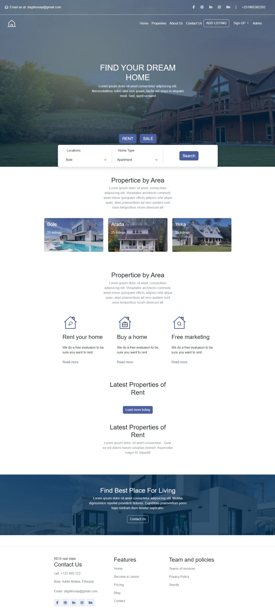
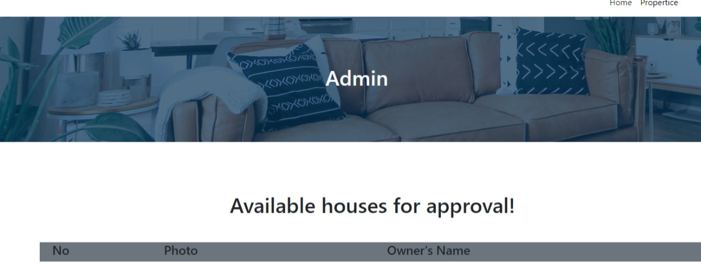
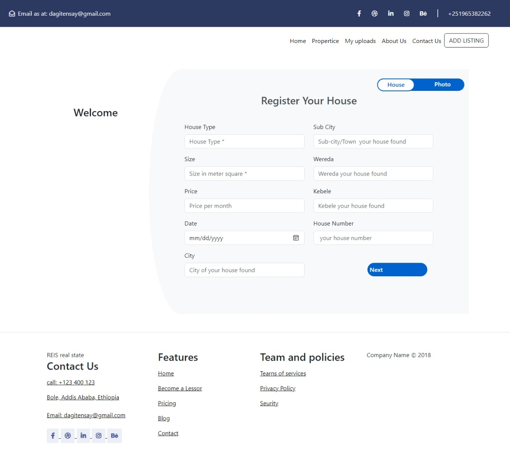
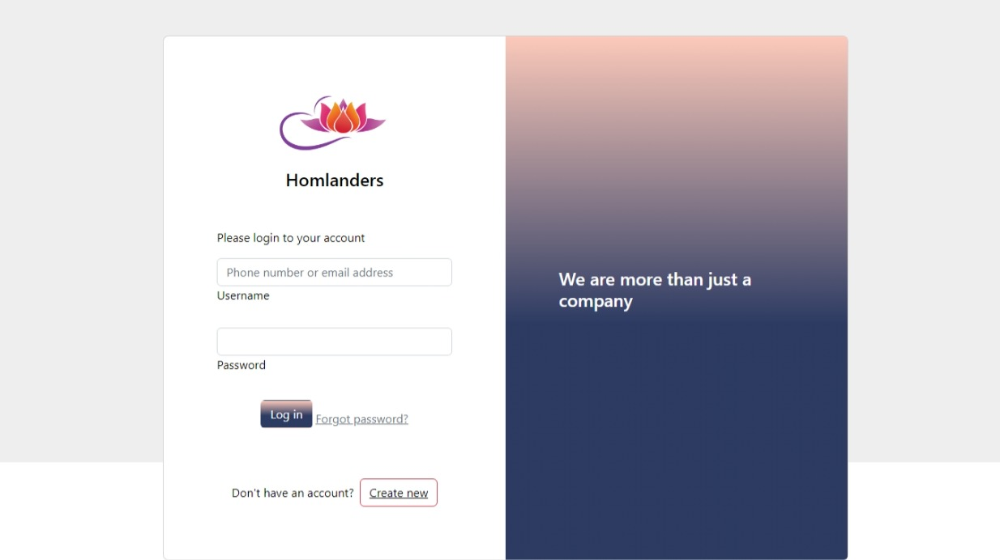
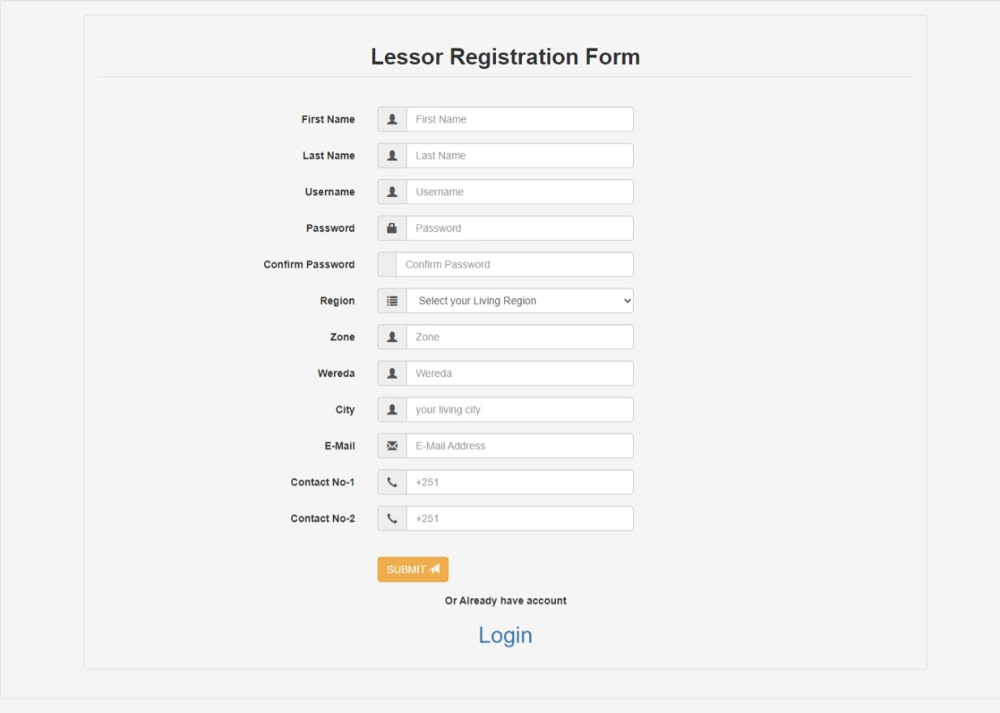
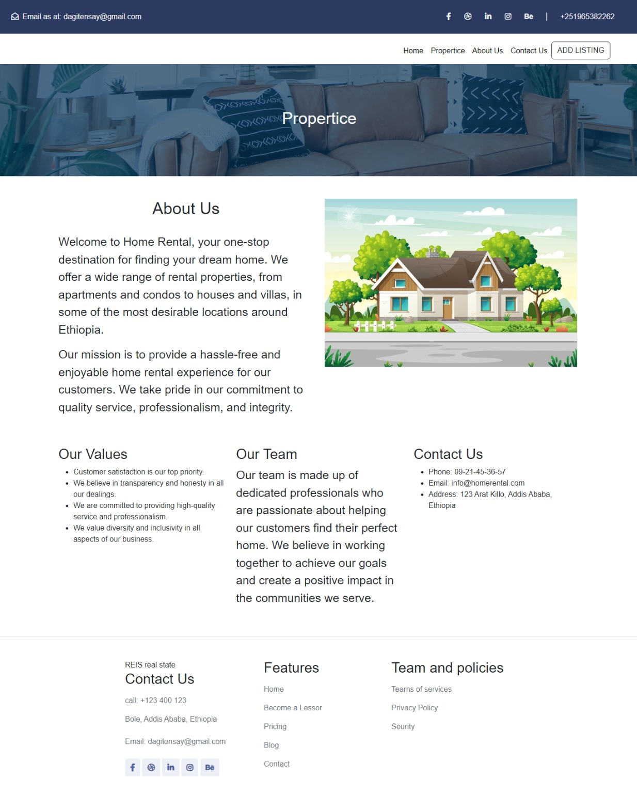

# Home Rental System

Home Rental System was designed to connect lessees and landlords in Addis Ababa using HTML, CSS, JavaScript, and Bootstrap as frontend tools, and Node.js (NestJS) as the backend language and framework.

## Table of Contents

- [Introduction](#introduction)
- [Technologies](#technologies)
  - [Frontend](#frontend)
  - [Backend](#backend)
- [What's Improved from Existing Solutions](#whats-improved-from-existing-solutions)
- [Future Considerations](#future-considerations)
- [How to Use](#how-to-use)
- [Screenshots](#screenshots)
- [Developers](#developers)
- [License](#license)

## Introduction

The system provides the necessary frontend and backend functionality to make it usable for individuals who need to find a home for rent or want to rent their home in Addis Ababa. It aims to create a reliable and secure environment controlled by the admin. The following features are included:

1. Ability to upload homes for rent with necessary details (images, home licenses, address).
2. Ability to search for homes using addresses and home types, and view detailed information to start a deal when interested.
3. Admin panel to approve homes by reviewing the license documents attached to the home details.
4. Ability to like, dislike, and report homes in case of scams.
5. Removal of homes and users from the system based on the number of reports.
6. "About Us" and "Contact" pages for user feedback.

## Technologies

### Frontend
- HTML/CSS
- JavaScript
- Bootstrap

### Backend
- Node.js
- NestJS
- MySQL

## What's Improved from Existing Solutions

- Increased accessibility to approximately 70% of the Addis Ababa population (around 20% in existing solutions) by implementing a system controlled by multiple admins and introducing a report functionality.
- Enhanced validity checking of uploaded homes through report functionality and admin approval based on attached licenses.

## Future Considerations

- Deploy the system to a production environment.
- Devlop mobile Application
- Integrating image compression algorithms and image formatting to improve performance and optimize storage usage.
- Integrating AI to enhance scam control within the system.

## How to Use

1. Install Node.js.
2. Clone the repository.
3. Navigate to the backend directory (`cd backend`) and run `npm install`.
4. Update the database URL in the environment variables (`.env` file).
5. Open the frontend index.html page.

## Screenshots

  

    
  

  

    
  

  

    
  

  

    
  

  

    
  

  

    
  

## Developers

1. Fasika Fikadu (Team Lead and README Writer) - Email: fasikafikadu38@gmail.com
2. Dagmawi Tensay
3. Deribew Shimles
4. Ephrem Shimles
5. Birhanu Asmamaw
6. Natnael Yimer
7. Enyew Anberber
8. Kaleab Tibebu
9. Natnael Dajene

## License

This project is licensed under the MIT License. See the [LICENSE](LICENSE) file for details.

